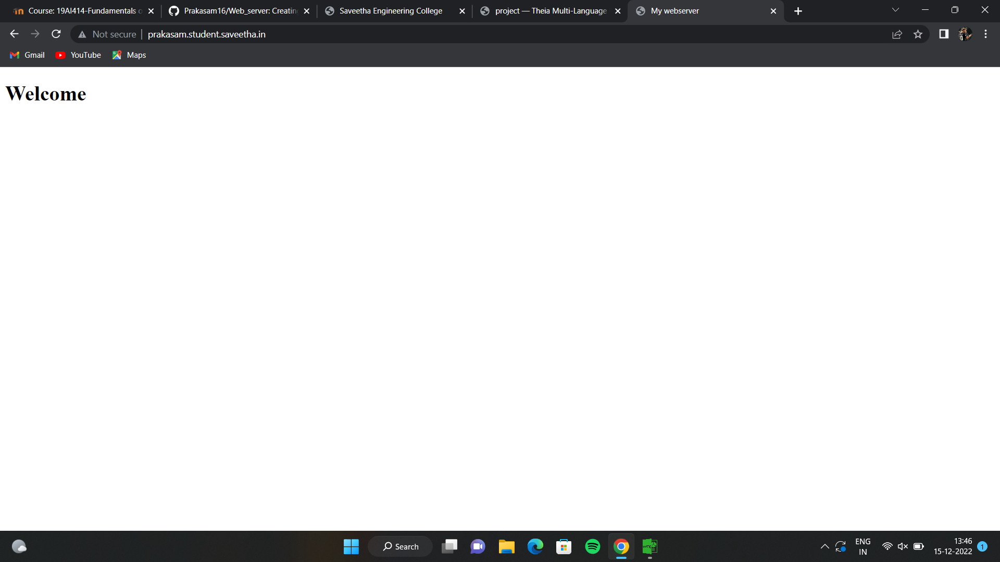

# Developing a Simple Webserver

# AIM:

Develop a webserver to display about top five web application development frameworks.

# DESIGN STEPS:

## Step 1:

HTML content creation is done

## Step 2:

Design of webserver workflow

## Step 3:

Implementation using Python code

## Step 4:

Serving the HTML pages.

## Step 5:

Testing the webserver

# PROGRAM:
```
from http.server import HTTPserver,baseHTTPrequesthandler
 content='''
 <!DOCTYPE html>
 <html>
 <head>
 <title>my webserver</title>
 </head>
 <body>
 <h1>wecome<h1>
 </body>
 </html>
 """
class myhandler(baseHTTrrequest)handler):
    def do_GET(self):
    print("request received")
    self.send_response(200)
    self.send_header('content-type', 'text/html; charset=utf-8')
    self.end_headers()
    self.wfile.write(content.encode())
server_address = ('',80)
httpd = HTTPserver(server_address,myhandler)
print("my webserver is running...")
http.server_forever()
```
# OUTPUT:


# RESULT:

The program is executed Succesfully
